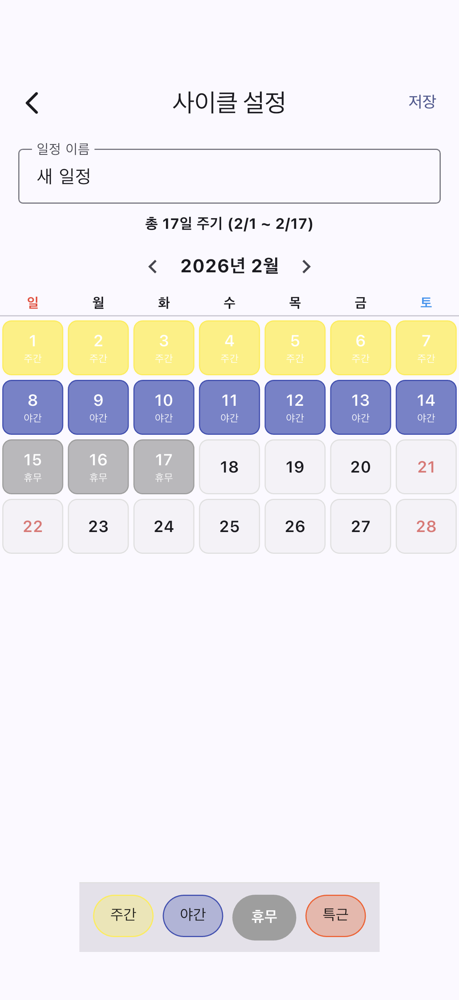
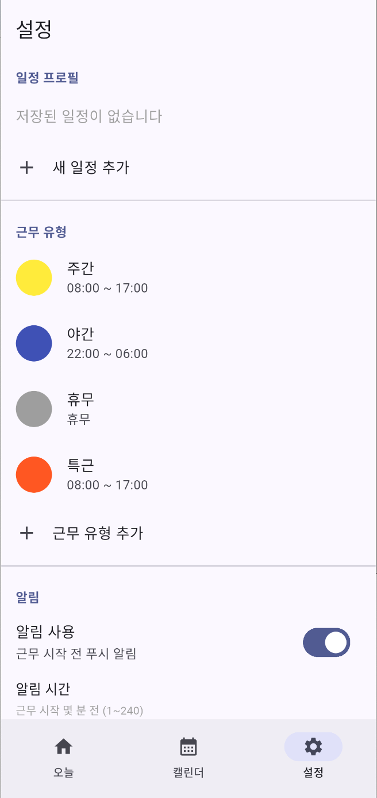

# Towa — 교대근무 일정 관리 앱

교대근무자를 위한 일정 관리 앱. 사이클을 등록하면 오늘 근무를 홈화면 위젯에서 바로 확인할 수 있습니다.

---

## 주요 기능

- **드래그로 사이클 설정** — 달력에서 날짜를 드래그해 주간/야간/휴무 등 근무 유형을 한 번에 등록
- **개별 날짜 예외 설정** — 특정 날짜만 다른 근무로 변경
- **홈화면 위젯** — 앱을 열지 않아도 오늘 근무 즉시 확인
  - iOS: Small / Medium / Large / 잠금화면 위젯
  - Android: 2×1 / 2×2 / 4×2 위젯
- **근무 시작 알림** — 근무 시작 N분 전 알림
- **커스텀 근무 유형** — 이름, 시간, 색상 직접 설정
- **여러 일정 관리** — 직장/부업 등 여러 패턴 전환 사용

---

## 스크린샷

| 홈 | 캘린더 | 사이클 설정 | 설정 |
|:---:|:---:|:---:|:---:|
|  |  |  |  |

---

## 기술 스택

| 항목 | 내용 |
|------|------|
| Framework | Flutter 3.x |
| 상태관리 | Riverpod |
| 라우팅 | go_router |
| 로컬 DB | Hive |
| iOS 위젯 | WidgetKit (Swift) |
| Android 위젯 | AppWidgetProvider (Kotlin) |
| 알림 | flutter_local_notifications |

---

## 프로젝트 구조

```
lib/
├── core/
│   ├── models/          # Schedule, ShiftType, DateOverride 등
│   ├── providers/       # Riverpod 프로바이더
│   ├── repositories/    # Hive 저장소
│   ├── services/        # 알림, 위젯 동기화, 근무 계산
│   └── router.dart
├── features/
│   ├── home/            # 홈 화면
│   ├── calendar/        # 캘린더
│   ├── cycle/           # 사이클 설정
│   ├── settings/        # 설정
│   └── splash/          # 스플래시
└── main.dart

ios/
├── Runner/              # Flutter 앱
└── ShiftWidget/         # WidgetKit 익스텐션

android/
└── app/src/main/kotlin/
    └── widget/          # AppWidget
```

---

## 시작하기

```bash
# 패키지 설치
flutter pub get

# iOS 실행
flutter run -d <ios-device-id>

# Android 실행
flutter run -d <android-device-id>

# 테스트
flutter test
```

### 요구사항

- Flutter 3.x
- Xcode 15+ (iOS 빌드)
- Android Studio (Android 빌드)
- iOS 16.0+ / Android 8.0+

---

## 개인정보처리방침

[Privacy Policy](https://fghjk000.github.io/towa-privacy-policy/)
